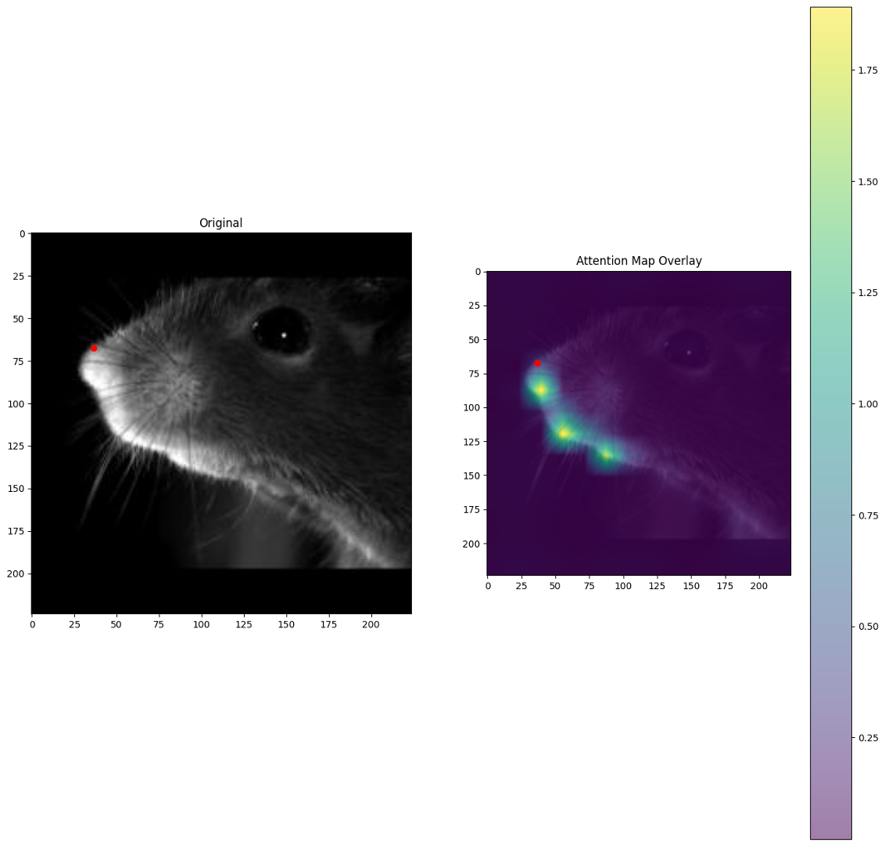
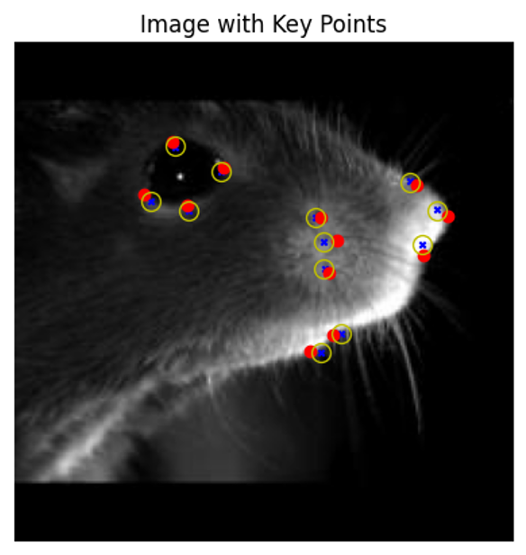
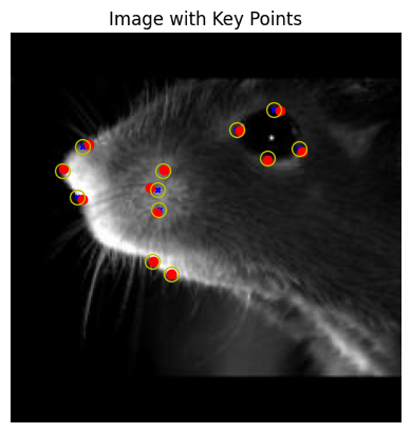
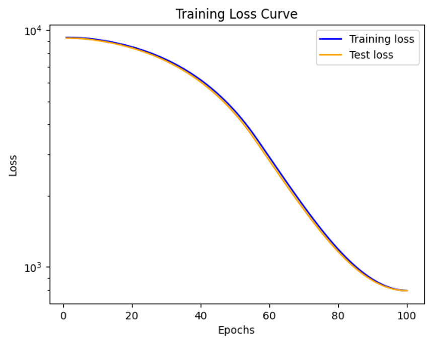

# Results ⭐️

## No Augmentation Imagenet normalization ViT B16 dropout = 0.0, 300 epochs

Blue = prediction generated by forward pass
Red = human annotated label
Yellow = predictions from evaluation during training

:::{figure}
:label: my-figure1
:align: left

    

Predictions and labels
:::

:::{figure}
:label: my-figure2
:align: left

    
    

Heat maps layer 1 and 12
:::

:::{figure}
:label: my-figure3
:align: left

    
    
    

Heat maps layer per KP (if code correct)
:::

Heat maps layer per KP (if code correct)
:::

:::{figure}
:label: my-figure4
:align: left

    

Training curve
:::

## TIMM ViT B16

Blue = prediction generated by forward pass
Red = human annotated label
Yellow = predictions from evaluation during training

:::{figure}
:label: my-figure5
:align: left

    
    
    

Predictions and labels
:::

:::

:::{figure}
:label: my-figure6
:align: left

    

Training curve
:::

## TIMM R50_ViT B16

TIMM model: vit_base_r50_s16_224  - I believe this is the equivalent to the hybrid model form Google's repo, but not sure

Blue = prediction generated by forward pass
Red = human annotated label
Yellow = predictions from evaluation during training

:::{figure}
:label: my-figure7
:align: left

    
    
    

Predictions and labels
:::

:::

:::{figure}
:label: my-figure8
:align: left

    

Training curve
:::

## ViT B16 dropout = 0.0

Blue = prediction generated by forward pass
Red = human annotated label
Yellow = predictions from evaluation during training

:::{figure}
:label: my-figure9
:align: left

    
    
    

Predictions and labels
:::

:::{figure}
:label: my-figure10
:align: left

    
    

Heat maps layer 1 and 12
:::

:::{figure}
:label: my-figure11
:align: left

    
    
    

Heat maps layer per KP (if code correct)
:::

:::{figure}
:label: my-figure12
:align: left

    

Training curve
:::

## ViT B16 dropout = 0.1
Blue = prediction generated by forward pass
Red = human annotated label
Yellow = predictions from evaluation during training

:::{figure}
:label: my-figure13
:align: left

    
    
    

Predictions and labels
:::

:::{figure}
:label: my-figure14
:align: left

    
    

Heat maps layer 1 and 12
:::

:::{figure}
:label: my-figure15
:align: left

    
    
    

Heat maps layer per KP (if code correct)
:::

:::{figure}
:label: my-figure16
:align: left

    

Training curve
:::

## R50_ViT B16 dropout = 0.1
Blue = prediction generated by forward pass
Red = human annotated label
Yellow = predictions from evaluation during training

:::{figure}
:label: my-figure17
:align: left

    
    
    

Predictions and labels
:::

:::{figure}
:label: my-figure18
:align: left

    
    

Heat maps layer 1 and 12
:::

:::{figure}
:label: my-figure19
:align: left

    
    
    

Heat maps layer per KP (if code correct)
:::

:::{figure}
:label: my-figure20
:align: left

    

Training curve
:::

## ResNet50
Red  = prediction generated by forward pass

:::{figure}
:label: my-figure21
:align: left

    
    
    

Predictions and labels
:::

## No Augmentation Imagenet normalization ViT B16 dropout = 0.0, 100 epochs

Dropout = 0.0
Normalization based on imagenet, not the standard [0.5, 0.5, 0.5]

No data augmentation, only pad+rescale

Blue = prediction generated by forward pass
Red = human annotated label
Yellow = predictions from evaluation during training

:::{figure}
:label: my-figure22
:align: left

    

Predictions and labels
:::

:::{figure}
:label: my-figure23
:align: left

    
    

Heat maps layer 1 and 12
:::

Heat maps layer per KP (if code correct)
:::

:::{figure}
:label: my-figure24
:align: left

    

Training curve
:::
